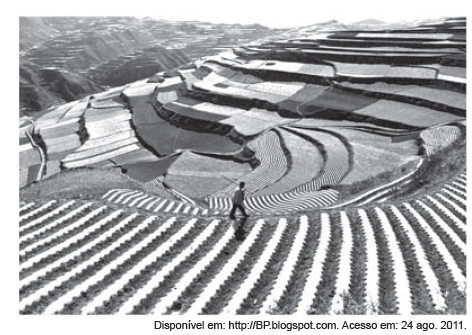

# q

*Na imagem, visualiza-se um método de cultivo e as transformações provocadas no espaço geográco. O objetivo i**mediato da técnica agrícola utilizada é*

# a
*controlar a erosão laminar.*

# b
*preservar as nascentes -uviais.*

# c
*diminuir a contaminação química.*

# d
*incentivar a produção transgênica.*

# e
*implantar a mecanização intensiva.*

# r
a

# s
A ilustração mostra a técnica agrícola do terraceamento, utilizada para diminuir a erosão laminar em áreas de alta declividade, graças à construção de rampas niveladas que diminuem a velocidade do escoamento superficial da água. Vale ressaltar que a implantação dessa forma de cultivo requer conhecimento técnico e baixa utilização de máquinas, devido às dificuldades impostas pela declividade do relevo.
