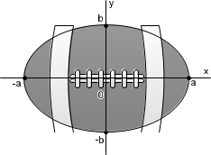

A figura representa a vista superior de uma bola de futebol americano, cuja forma é um elipsoide obtido pela rotação de uma elipse em torno do eixo das abscissas. Os valores *a* e *b *são, respectivamente, a metade do seu comprimento horizontal e a metade do seu comprimento vertical. Para essa bola, a diferença entre os comprimentos horizontal e vertical é igual à metade do comprimento vertical.

Considere que o volume aproximado dessa bola é dado por $V = ab^2$. O volume dessa bola, em função apenas de *b*, é dado por

- [ ] $8b^3$
- [x] $6b^3$
- [ ] $5b^3$
- [ ] $4b^3$
- [ ] $2b^3$

Do enunciado: 2a – 2b = b

 

$a = \cfrac{3b}{2}$

 

$V = 4 \cdot a \cdot b^2$

 

E, como $a = \cfrac{3b}{2}$ então :

 

$V = 4 \cdot \cfrac{3b}{2} \cdot b^2 = 6b^3$
