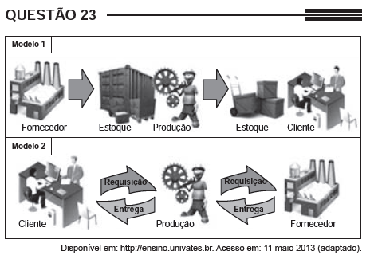

*Na imagem, estão representados dois modelos de produção. A possibilidade de uma crise de superprodução é **distinta entre eles em função do seguinte fator:*

- [ ] *Origem da matéria-prima.*
- [ ] *Qualificação da mão de obra.*
- [ ] *Velocidade de processamento.*
- [x] *Necessidade de armazenamento.*
- [ ] *Amplitude do mercado consumidor.*

Ao analisar a imagem da questão, identificamos o sistema de produção fordista no modelo 1. Essa forma de produzir tem entre suas características grandes estoques de componentes, visando a uma menor dependênciade fornecedores. Após a finalização da mercadoria, surge o estoque desse produto final que posteriormente será vendido. No modelo 2, identificamos o modelo de produção toyotista, que apresenta como uma de suas características o *“just in time”*, também chamado de “produção puxada”, de acordo com o qual o cliente faz a requisição da mercadoria antes de sua produção. A partir desse momento, a indústria aciona seus fornecedores, e não guarda estoques nem de componentes nem do produto final, sendo, dessa forma, menos vulnerável a uma crise de superprodução.
