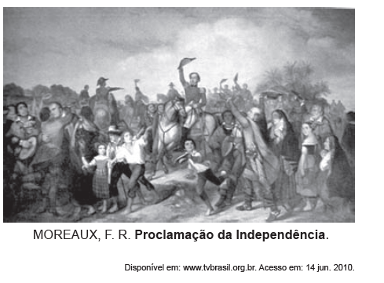
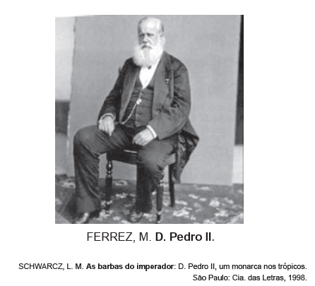

*As imagens, que retratam D. Pedro I e D. Pedro II, procuram transmitir determinadas representações políticas **acerca dos dois monarcas e seus contextos de atuação. A ideia que cada imagem evoca é, respectivamente:*

- [ ] *Habilidade militar — riqueza pessoal.*
- [x] *Liderança popular — estabilidade política.*
- [ ] *Instabilidade econômica — herança europeia.*
- [ ] *Isolamento político — centralização do poder.*
- [ ] *Nacionalismo exarcebado — inovação administrativa.*

A primeira imagem revela um D. Pedro I em primeiro plano, ao centro e acima dos demais personagens representados, entre eles muitos populares, realçando o aspecto de liderança do processo de independência.

Já a segunda revela um D. Pedro II mais velho e sereno, aparentando a sabedoria necessária para a condução do processo político e suas nuances.
