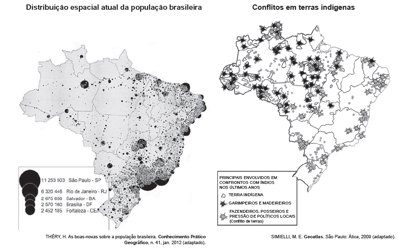

*Os mapas representam distintos padrões de distribuição de processos socioespaciais. Nesse sentido, a menor **incidência de disputas territoriais envolvendo povos indígenas se explica pela*

- [ ] *fertilização natural dos solos.*
- [ ] *expanção da fronteira agrícola.*
- [ ] *intensicação da migração de retorno.*
- [ ] *homologação de reservas extrativistas.*
- [x] *concentração histórica da urbanização.*

Há uma menor incidência de conflitos em terras indígenas na porção litorânea do Brasil. Os ciclos econômicos vividos pelo país somados aos processos de industrialização e urbanização, explicam a maior concentração da população brasileira nessa área, onde a maior parte dos povos indígenas que ali viviam foi dizimada ou expulsa.

Na atualidade, as regiões que mais apresentam conflitos em terras indígenas são o Centro-Oeste e o Norte, devido, principalmente, a expansão da fronteira agrícola, extração de madeira e garimpagem.
