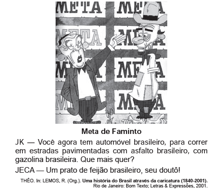

*A charge ironiza a política desenvolvimentista do governo Juscelino Kubitschek, ao*

- [ ] *evidenciar que o incremento da malha viária diminuiu as desigualdades regionais do país.*
- [ ] *destacar que a modernização das indústrias dinamizou a produção de alimentos para o mercado interno.*
- [x] *enfatizar que o crescimento econômico implicou aumento das contradições socioespaciais.*
- [ ] *ressaltar que o investimento no setor de bens duráveis incrementou os salários de trabalhadores.*
- [ ] *mostrar que a ocupação de regiões interioranas abriu frente de trabalho para a população local.*

A charge e o diálogo em questão revelam que a aceleração econômica, promovida pelo plano de metas de J.K., foi mais eficaz em seus aspectos econômicos como transporte, energia e indústria. Porém, os aspectos sociais, como a concentração de renda e as necessidades básicas do homem do interior (Jeca), não foram plenamente atendidas.
