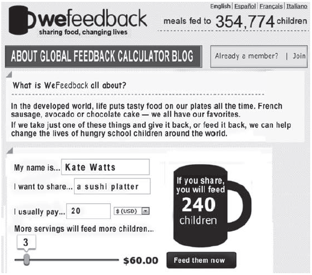

Disponível em: http://wefeedback.org. Acesso em: 30 jul. 2012.

A internet tem servido a diferentes interesses, ampliando, muitas vezes, o contato entre pessoas e instituições. Um exemplo disso é o site WeFeedback, no qual a internauta Kate Watts

- [ ] comprou comida em promoção.
- [ ] inscreveu-se em concurso.
- [x] fez doação para caridade.
- [ ] participou de pesquisa de opinião.
- [ ] voluntariou-se para trabalho social.

O texto se refere a uma campanha on-line para obtenção de donativos destinados a alimentar crianças famintas. A internauta Kate Watts fez doação para caridade, como se pode perceber pelas frases “I want to share a sushi platter” e “I usually pay 20 US$”.
