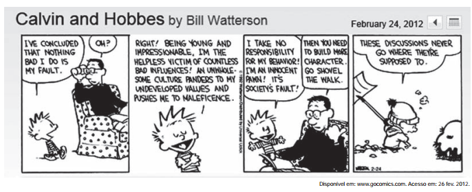

 

A partir da leitura dessa tirinha, infere-se que o discurso de Calvin teve um efeito diferente do pretendido, uma vez que ele

 

- [ ] decide tirar a neve do quintal para convencer seu pai sobre seu discurso.
- [ ] culpa o pai por exercer inuência negativa na formação de sua personalidade.
- [x] comenta que suas discussões com o pai não correspondem às suas expectativas.
- [ ] conclui que os acontecimentos ruins não fazem falta para a sociedade
- [ ] reclama que é vítima de valores que o levam a atitudes inadequadas.

Calvin diz ao pai que nada de ruim que ele próprio faça é culpa dele mesmo. Calvin é jovem, impressionável e vítima indefesa de más influências. Uma cultura perniciosa procura satisfazer seus valores ainda não desenvolvidos, pressionando-o a agir incorretamente. Ele diz que não é responsável por seu comportamento, sendo apenas parte de um joguete inocente, que é tudo culpa da sociedade. Ao ouvir isso, o pai diz a Calvin que o menino precisa desenvolver mais o caráter e ordena que ele tire a neve da calçada.

Então, no último quadrinho, Calvin comenta que esse tipo de discussão nunca resulta no que ele pretende, ou seja, nunca corresponde às suas expectativas.
