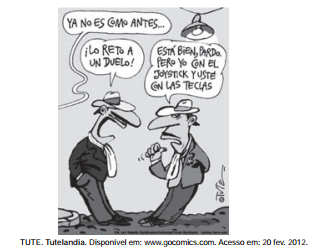

A charge evoca uma situação de disputa. Seu efeito humorístico reside no(a)

- [ ] aceitação imediata da provocação.
- [ ] descaracterização do convite a um desao.
- [x] sugestão de armas não convencionais para um duelo.
- [ ] deslocamento temporal do comentário lateral.
- [ ] posicionamento relaxado dos personagens.

Trata-se de uma charge que, humoristicamente, revela as armas do duelo nos tempos atuais (joystick e teclas).

        