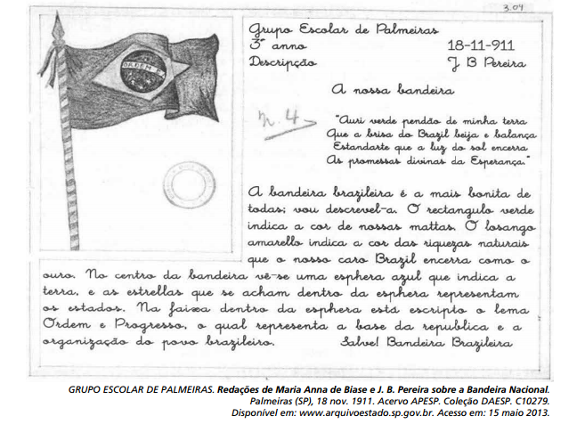

O documento foi retirado de uma exposição on-line de manuscritos do estado de São Paulo do início do século XX. Quanto à relevância social para o leitor da atualidade, o texto

- [x] funciona como veículo de transmissão de valores patrióticos próprios do período em que foi escrito.
- [ ] cumpre uma função instrucional de ensinar regras de comportamento em eventos cívicos.
- [ ] deixa subentendida a ideia de que o brasileiro preserva as riquezas naturais do país.
- [ ] argumenta em favor da construção de uma nação com igualdade de direitos
- [ ] apresenta uma metodologia de ensino restrita a uma determinada época.

A descrição da bandeira nacional, realizada por um estudante do 3o ano de grupo escolar, em 1911, transmite ao leitor contemporâneo alguns valores patrióticos próprios do período em que foi escrito: um nacionalismo ufanista acentuadamente republicano.

Observação:

Cumpre ressaltar que a escolha da palavra “funciona” (presente do indicativo) pode dar a entender que a transmissão de valores patrióticos mencionada na alternativa vale para o leitor, ou seja, que ele, por meio desse texto, receberia esses valores.
