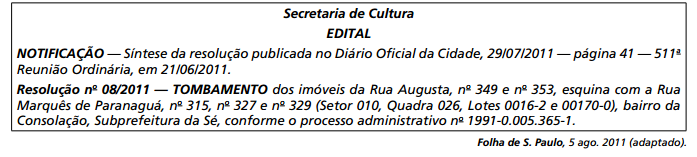

# q

Um leitor interessado nas decisões governamentais escreve uma carta para o jornal que publicou o edital, concordando com a resolução sintetizada no Edital da Secretaria de Cultura. Uma frase adequada para expressar sua concordância é:

# a
Que sábia iniciativa! Os prédios em péssimo estado de conservação devem ser derrubados.

# b
Até que enm! Os edifícios localizados nesse trecho descaracterizam o conjunto arquitetônico da Rua Augusta.

# c
Parabéns! O poder público precisa mostrar sua força como guardião das tradições dos moradores locais.

# d
Justa decisão! O governo dá mais um passo rumo à eliminação do problema da falta de moradias populares

# e
Congratulações! O patrimônio histórico da cidade merece todo empenho para ser preservado.

# r
e

# s
O tombamento de um imóvel pelo poder público diz respeito a sua proteção e conservação, em virtude do valor artístico ou histórico que ele possui.
