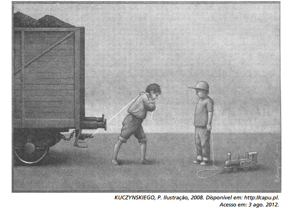

O artista gráco polonês Pawla Kuczynskiego nasceu em 1976 e recebeu diversos prêmios por suas ilustrações. Nessa obra, ao abordar o trabalho infantil, Kuczynskiego usa sua arte para

- [ ] difundir a origem de marcantes diferenças sociais.
- [ ] estabelecer uma postura proativa da sociedade
- [x] provocar a reflexão sobre essa realidade
- [ ] propor alternativas para solucionar esse problema.
- [ ] retratar como a questão é enfrentada em vários países do mundo

A ilustração do polonês Pawla Kuczynskiego aborda claramente a questão do trabalho infantil ao retratar duas crianças frente a frente: uma puxando um trenzinho de brinquedo e outra um vagão de carga. O artista polonês provoca a reflexão sobre essa realidade por meio de seu trabalho artístico.

        