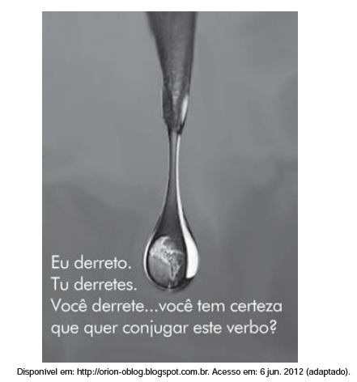

O cartaz aborda a questão do aquecimento global. A relação entre os recursos verbais e não verbais nessa propaganda revela que

- [ ] o discurso ambientalista propõe formas radicais de resolver os problemas climáticos.
- [ ] a preservação da vida na Terra depende de ações de dessalinização da água marinha.
- [ ] a acomodação da topografia terrestre desencadeia o natural degelo das calotas polares.
- [ ] o descongelamento das calotas polares diminui a quantidade de água doce potável do mundo.
- [x] a agressão ao planeta é dependente da posição assumida pelo homem frente aos problemas ambientais.

A relação entre recursos verbais e não verbais revela que o aquecimento global depende da posição assumida pela humanidade diante dele. Ao questionar o leitor, perguntando-lhe se pretende conjugar o verbo “derreter”, subentende-se que o derretimento causado pelo aquecimento global pode cessar, se a humanidade assim decidir.
