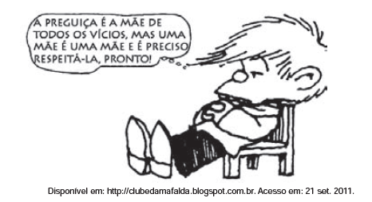

# q

Nessa charge, o recurso morfossintático que colabora para o efeito de humor está indicado pelo(a)

# a
emprego de uma oração adversativa, que orienta a quebra da expectativa ao final.

# b
uso de conjunção aditiva, que cria uma relação de causa e efeito entre as ações.

# c
retomada do substantivo "mãe", que desfaz a ambiguidade dos sentidos a ele atribuídos.

# d
utilização da forma pronominal "la", que reflete um tratamento formal do filho em relação à "mãe".

# e
repetição da forma verbal "é", que reforça a relação de adição existente entre as orações.

# r
a

# s
O recurso morfossintático que colabora para o efeito de humor é a conjunção adversativa “mas”. É ela que produz a quebra de expectativa. Ao associar a preguiça como “mãe de todos os vícios”, no início da fala, cria--se a expectativa de crítica à preguiça. Porém, por meio da oração adversativa introduzida pela conjunção “mas”, ele prega o respeito à preguiça, quebrando a expectativa inicial gerada no leitor.
