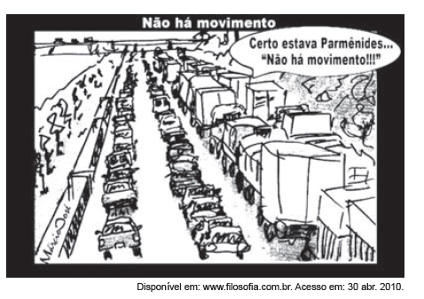

Pelas características da linguagem visual e pelas escolhas vocabulares, pode-se entender que o texto possibilita a reflexão sobre uma problemática contemporânea ao

- [ ] criticar o transporte rodoviário brasileiro, em razão da grande quantidade de caminhões nas estradas.
- [x] ironizar a dificuldade de locomoção no trânsito urbano, devida ao grande fluxo de veículos.
- [ ] expor a questão do movimento como um problema existente desde tempos antigos, conforme frase citada.
- [ ] restringir os problemas de tráfego a veículos particulares, defendendo, como solução, o transporte público.
- [ ] propor a ampliação de vias nas estradas, detalhando o espaço exíguo ocupado pelos veículos nas ruas.

O texto sincrético apresentado pela banca, extraído de um *site *de filosofia, se utiliza das ideias de um filósofo (Parmênides) com vistas a ironizar uma problemática contemporânea: a dificuldade de locomoção no trânsito urbano devido ao grande fluxo de veículos.
