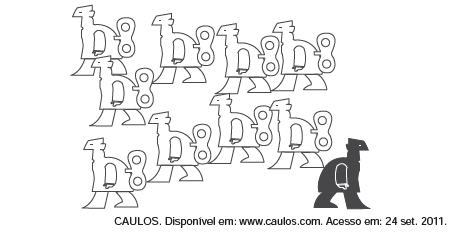

O cartum faz uma crítica social. A figura destacada está em oposição às outras e representa a

- [ ] opressão das minorias sociais.
- [ ] carência de recursos tecnológicos.
- [ ] falta de liberdade de expressão.
- [ ] defesa da qualificação profissional.
- [x] reação ao controle do pensamento coletivo.

As figuras em branco representam homens como se fossem bonecos de corda, portanto manipuláveis. Não à toa, todos se deslocam na mesma direção. Destacado em preto e sem corda, aparece um único homem pondo-se em direção contrária. O contraste entre as figuras tematiza a reação do indivíduo à alienação da coletividade.
