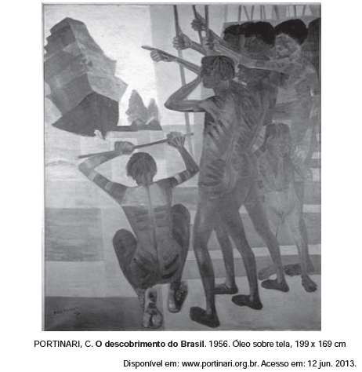

**TEXTO I**

Andaram na praia, quando saímos, oito ou dez deles; e daí a pouco começaram a vir mais. E parece-me que viriam, este dia, à praia, quatrocentos ou quatrocentos e cinquenta. Alguns deles traziam arcos e  flechas, que todos trocaram por carapuças ou por qualquer coisa que lhes davam. \[...] Andavam todos tão bem-dispostos, tão bem feitos e galantes com suas tinturas que muito agradavam.

CASTRO, S. **A carta de Pero Vaz de Caminha***. *Porto Alegre: L\&PM, 1996 (fragmento).

**TEXTO II**

Pertencentes ao patrimônio cultural brasileiro, a carta de Pero Vaz de Caminha e a obra de Portinari retratam a chegada dos portugueses ao Brasil. Da leitura dos textos, constata-se que

- [ ] a carta de Pero Vaz de Caminha representa uma das primeiras manifestações artísticas dos portugueses em terras brasileiras e preocupa-se apenas com a estética literária.
- [ ] a tela de Portinari retrata indígenas nus com corpos pintados, cuja grande significação é a afirmação da arte acadêmica brasileira e a contestação de uma linguagem moderna.
- [x] a carta, como testemunho histórico-político, mostra o olhar do colonizador sobre a gente da terra, e a pintura destaca, em primeiro plano, a inquietação dos nativos.
- [ ] as duas produções, embora usem linguagens diferentes — verbal e não verbal —, cumprem a mesma função social e artística.
- [ ] a pintura e a carta de Caminha são manifestações de grupos étnicos diferentes, produzidas em um mesmo momento histórico, retratando a colonização.

A comparação entre a **Carta de Pero Vaz de Caminha **(1500) e o quadro **O descobrimento do Brasil **(1956), de Cândido Portinari, coloca frente a frente obras distantes no tempo e que se utilizam de  linguagens muito diferentes em sua composição. Ainda assim, as duas referem-se ao momento do início da colonização brasileira pelos portugueses. A carta, mais do que obra artística, é compreendida como um documento que revela o olhar primeiro do colonizador sobre o país e sua gente; e a tela, já afastada do modelo de arte acadêmica, destaca, em primeiro plano, a inquietação do nativo com a chegada do colonizador. Ambos os trabalhos constituem duas referências fundamentais do patrimônio cultural brasileiro.

        