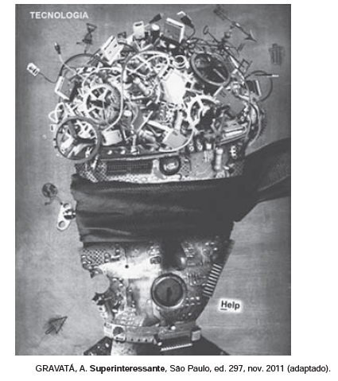

**O que a internet esconde de você**

Sites *de busca manipulam resultados. Redes sociais **decidem quem vai ser seu amigo — e descartam as **pessoas sem avisar. E, para cada *site *que você pode **acessar, há 400 outros invisíveis. Prepare-se para **conhecer o lado oculto da internet.*

Analisando-se as informações verbais e a imagem associada a uma cabeça humana, compreende-se que a venda

 

- [ ] representa a amplitude de informações que compõem a internet, às quais temos acesso em redes sociais e *sites *de busca.
- [x] faz uma denúncia quanto às informações que são omitidas dos usuários da rede, sendo empregada no sentido conotativo.
- [ ] diz respeito a um buraco negro digital, onde estão escondidas as informações buscadas pelo usuário nos *sites *que acessa.
- [ ] está associada a um conjunto de restrições sociais presentes na vida daqueles que estão sempre conectados à internet.
- [ ] remete às bases de dados da *web*, protegidas por senhas ou assinaturas e às quais o navegador não tem acesso.

O texto verbal fundamenta a ideia de que a internet, em seus *sites*, manipula resultados. Isso pode ser associado ao pano preto que envolve os olhos da cabeça humana representada no texto não verbal. Há nessa venda, pois, a sugestão do tema da “manipulação”, ou da “ocultação”, configurando-lhe sentido conotativo.

        