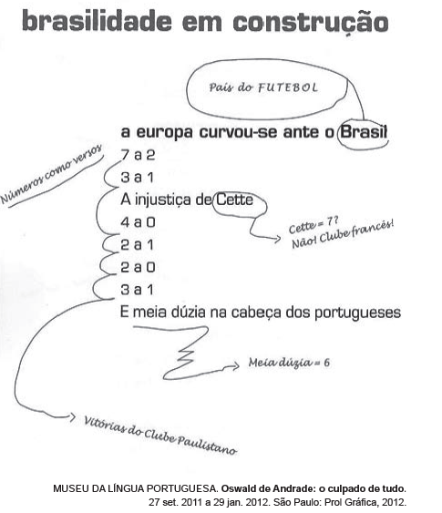

O poema de Oswald de Andrade remonta à ideia de que a brasilidade está relacionada ao futebol. Quanto à questão da identidade nacional, as anotações em torno dos versos constituem

- [x] direcionamentos possíveis para uma leitura crítica de dados histórico-culturais.
- [ ] forma clássica da construção poética brasileira.
- [ ] rejeição à ideia do Brasil como o país do futebol.
- [ ] intervenções de um leitor estrangeiro no exercício de leitura poética.
- [ ] lembretes de palavras tipicamente brasileiras substitutivas das originais.

A instalação “brasilidade em construção” do Museu da Língua Portuguesa explora diversos fatores socioculturais. Através de intervenções no poema “a europa curvou-se ante o Brasil”, de Oswald de Andrade, a montagem cria direcionamentos para uma leitura crítica, fazendo reflexões a respeito da importância do futebol na cultura brasileira, como em “Brasil ---> País do FUTEBOL”, sobre clubes da época como “Cette = clube francês!”e “Vitórias do Clube Paulistano”, e a respeito do uso do esporte como instrumento de supremacia sobre os antigos colonizadores, ao fazer referencia à vitória sobre os portugueses em “E meia dúzia na cabeça dos portugueses”.
