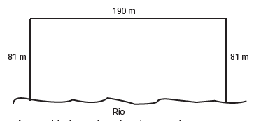

     Para o reorestamento de uma área, deve-se cercar totalmente, com tela, os lados de um terreno, exceto o lado margeado pelo rio, conforme a gura. Cada rolo de tela que será comprado para confecção da cerca contém 48 metros de comprimento.

A quantidade mínima de rolos que deve ser comprada para cercar esse terreno é

- [ ] 6\.
- [ ] 7\.
- [x] 8\.
- [ ] 11\.
- [ ] 12\.

O comprimento total T de tela, necessário para cercar a área, é :

$T = 2 \cdot 81 + 190$

$T = 352\\,m$.

Cada rolo contém 48 metros e $\cfrac{352}{48} = 7,33$, logo a quantidade mínima de rolos é 8.

 
