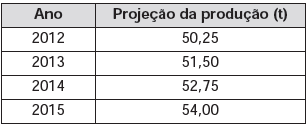

# q
     As projeções para a produção de arroz no período de 2012-2021, em uma determinada região produtora, apontam para uma perspectiva de crescimento constante da produção anual. O quadro apresenta a quantidade de arroz, em toneladas, que será produzida nos primeiros anos desse período, de acordo com essa projeção.

A quantidade total de arroz, em toneladas, que deverá ser produzida no período de 2012 a 2021 será de

# a
497,25.

# b
500,85.

# c
502,87.

# d
558,75.

# e
563,25.

# r
d

# s
A sequência formada pelas projeções anuais das quantidades produzidas de arroz, em toneladas, é uma PA com primeiro termo 50,25 (produção de 2012) e razão 1,25.

Nessas condições, a produção em 2021 será dada por:

50,25 + (10 – 1) x 1,25 = 61,50

Assim, o total de produção será

$\cfrac{(50,25 + 61,50) \cdot 10}{2} = 558,75$

ou seja, 558,75 toneladas.
