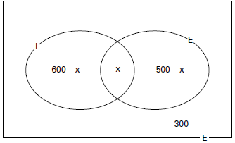

     Numa escola com 1200 alunos foi realizada uma pesquisa sobre o conhecimento desses em duas línguas estrangeiras, inglês e espanhol.

     Nessa pesquisa constatou-se que 600 alunos falam inglês, 500 falam espanhol e 300 não falam qualquer um desses idiomas.

Escolhendo-se um aluno dessa escola ao acaso e sabendo-se que ele não fala inglês, qual a probabilidade de que esse aluno fale espanhol?

- [x] $\cfrac{1}{2}$
- [ ] $\cfrac{5}{8}$
- [ ] $\cfrac{1}{4}$
- [ ] $\cfrac{5}{6}$
- [ ] $\cfrac{5}{14}$

Seja x o número de alunos que falam inglês e espanhol. No diagrama de Venn temos:

Assim:

600 – x + x + 500 – x + 300 = 1200

x = 200

Sabendo-se que ele não fala inglês, o ”novo espaço amostral“ seria, então, formado por

500 – 200 + 300 = 600 alunos.

A probabilidade de que esse aluno fale espanhol é, portanto,

$\cfrac{300}{600} = \cfrac{1}{2}$.
