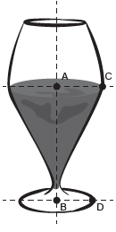
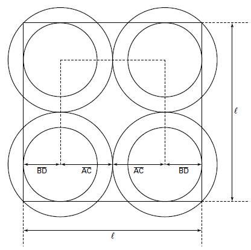

# q
     Um restaurante utiliza, para servir bebidas, bandejas com base quadradas. Todos os copos desse restaurante têm o formato representado na gura:

Considere que $\overline{AC} = \cfrac{7}{5}\overline{BD}$ que *l* é a medida de um dos lados da base da bandeja.

Qual deve ser o menor valor da razão $\cfrac{l}{\overline{BD}}$ para que uma bandeja tenha capacidade de portar exatamente quatro copos de uma só vez?

# a
2

# b
$\cfrac{14}{5}$

# c
4

# d
$\cfrac{24}{5}$

# e
$\cfrac{28}{5}$

# r
d

# s
A figura a seguir mostra a vista superior da bandeja para o menor valor possível de l, de modo que a bandeja tenha capacidade de portar quatro copos de uma só vez.

Observe que apenas as bases dos quatro copos devem estar totalmente contidas na bandeja. Dessa forma, devemos ter:

$l \geq 2 \cdot \overline{AC} + 2 \cdot \overline{BD}$

$l \geq 2 \cdot \cfrac{7}{5} \overline{BD} + 2 \cdot \overline{BD}$

$l \geq \cfrac{24}{5} \overline{BD}$

$\cfrac{l}{\overline{BD}} \geq \cfrac{24}{5}$
