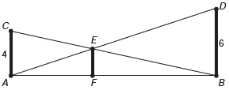

O dono de um sítio pretende colocar uma haste de sustentação para melhor firrmar dois postes de comprimentos iguais a 6m e 4m. A figura representa a situação real na qual os postes são descritos pelos segmentos AC e BD e a haste é representada pelo EF, todos perpendiculares ao solo, que é indicado pelo segmento de reta AB. Os segmentos AD e BC representam cabos de aço que serão instalados.

Qual deve ser o valor do comprimento da haste EF?

- [ ] 1 m
- [ ] 2 m
- [x] 2,4 m
- [ ] 3 m
- [ ] $2 \sqrt{6} \\, m$

Como $\Delta ACB \sim \Delta FEB$, tem-se :

$\cfrac{\overline{FB}}{\overline{AB}} = \cfrac{\overline{EF}}{4}$

$\overline{FB} = \cfrac{\overline{EF}}{4} \cdot \overline{AB}$          **(1)**

Como $\Delta BDA \sim \Delta FEA$, tem-se:

$\cfrac{\overline{AF}}{\overline{AB}} = \cfrac{\overline{EF}}{6}$

$\overline{AF} = \cfrac{\overline{EF}}{6} \cdot \overline{AB}$          **(2)**

Tem-se ainda que 

$\overline{AF} + \overline{FB} = \overline{AB}$.

Assim, de **(1)** e **(2)**, vem:

$ \cfrac{\overline{EF}}{6} \cdot \overline{AB} + \cfrac{\overline{EF}}{4} \cdot \overline{AB} = \overline{AB}$

$\cfrac{\overline{EF}}{6} + \cfrac{\overline{EF}}{4} = 1$

$2 \overline{EF} + 3 \overline{EF} = 12$

$5 \cdot \overline{EF}= 12$

$\overline{EF} = 2,4$

ou seja, o comprimento de EF é 2,4 m.
