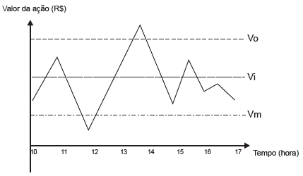
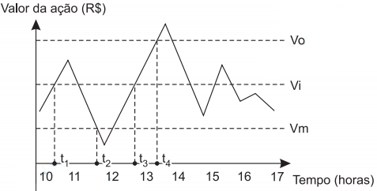

Um investidor inicia um dia com x ações de uma empresa. No decorrer desse dia, ele efetua apenas dois tipos de operações, comprar ou vender ações.

Para realizar essas operações, ele segue estes critérios:

I. vende metade das ações que possui, assim que seu valor fica acima do valor ideal (*Vi*);

II. compra a mesma quantidade de ações que possui, assim que seu valor fica abaixo do valor mínimo (*Vm*);

III. vende todas as ações que possui, quando seu valor fica acima do valor ótimo (*Vo*).

O gráfico apresenta o período de operações e a variação do valor de cada ação, em reais, no decorrer daquele dia e a indicação dos valores ideal, mínimo e ótimo.

 

Quantas operações o intestidor fez naquele dia?

- [ ] 3
- [x] 4
- [ ] 5
- [ ] 6
- [ ] 7

 

As operações feitas pelo investidor ocorrem nos instantes imediatamentes posteriores a $t\_1 $(critério I), $t\_2$ (critério II), $t\_3$(critério I) e $t\_4$(critério III). Assim, o total de operações realizadas pelo investidor é 4 (quatro).

        