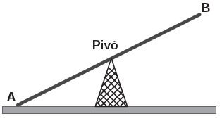
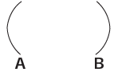
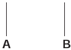
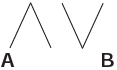
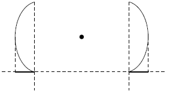

     Gangorra é um brinquedo que consiste de uma tábua longa e estreita equilibrada e xada no seu ponto central (pivô). Nesse brinquedo, duas pessoas sentam-se nas extremidades e, alternadamente, impulsionam-se para cima, fazendo descer a extremidade oposta, realizando, assim, o movimento da gangorra.

Considere a gangorra representada na figura, em que os pontos A e B são equidistantes do pivô:

A projeção ortogonal da trajetória dos pontos A e B, sobre o plano do chão da gangorra, quando esta se encontra em movimento, é:

- [ ] 
- [x] 
- [ ] 
- [ ] 
- [ ] 

Os pontos A e B descrevem arcos de uma circunferência contida em um plano vertical.

Como todas as projeções ortogonais de curvas contidas nesse plano, sobre o plano do chão da gangorra, pertencem a uma mesma reta, conclui-se que a projeção ortogonal da trajetória dos pontos A e B é dada por dois segmentos de reta, contidos em uma mesma reta.

        