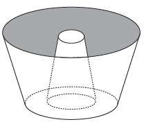

     Uma cozinheira, especialista em fazer bolos, utiliza uma forma no formato representado na figura:

     Nela identifica-se a representação de duas figuras geométricas tridimensionais.

Essas figuras são

- [ ] um tronco de cone e um cilindro.
- [ ] um cone e um cilindro.
- [ ] um tronco de pirâmide e um cilindro.
- [x] dois troncos de cone.
- [ ] dois cilindros.

Na figura, identifica-se a representação de um sólido obtido a partir de dois troncos de cone.
