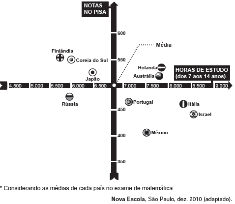

**Uma falsa relação**

     O cruzamento da quantidade de horas estudadas com o desempenho no Programa Internacional de Avaliação de Estudantes (Pisa) mostra que mais tempo na escola não é garantia de nota acima da média.

Dos países com notas abaixo da média nesse exame, aquele que apresenta maior quantidade de horas de estudo é

- [ ] Finlândia.
- [ ] Holanda.
- [x] Israel.
- [ ] México.
- [ ] Rússia.

Do gráfico, observa-se que os países com notas abaixo da média são Rússia, Portugal, México, Itália e Israel; desses, o que apresenta a maior quantidade de horas de estudo é Israel.
