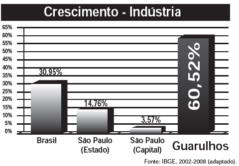

A cidade de Guarulhos (SP) tem o 8º PIB municipal do Brasil, além do maior aeroporto da América do Sul. Em proporção, possui a economia que mais cresce em indústrias, conforme mostra o gráfico.

Analisando os dados percentuais do gráfico, qual a diferença entre o maior e o menor centro em crescimento no polo das indústrias?

- [ ] 75,28
- [ ] 64,09
- [x] 56,95
- [ ] 45,76
- [ ] 30,07

Do gráfico tem-se que a diferença entre o maior (Guarulhos) e o menor (São Paulo, capital) crescimento no polo das indústrias é:

60,52 – 3,57 = 56,95 pontos percentuais.
