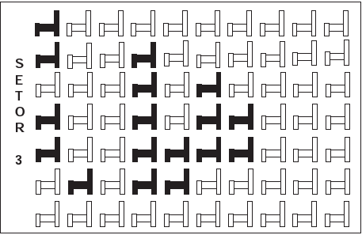

Em um certo teatro, as poltronas são divididas em setores. A figura apresenta a vista do setor 3 desse teatro, no qual as cadeiras escuras estão reservadas e as claras não foram vendidas.

A razão que representa a quantidade de cadeiras reservadas do setor 3 em relação ao total de cadeiras desse mesmo setor é

- [x] $\cfrac{17}{70}$
- [ ] $\cfrac{17}{53}$
- [ ] $\cfrac{53}{70}$
- [ ] $\cfrac{53}{17}$
- [ ] $\cfrac{70}{17}$

O número total de cadeiras é igual a 7  10 = 70. O número de cadeiras reservadas é igual a 17.

A razão pedida é $\cfrac{17}{70}$.
