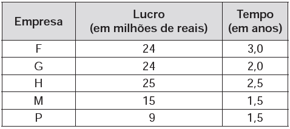

     Cinco empresas de gêneros alimentícios encontram-se à venda. Um empresário, almejando ampliar os seus investimentos, deseja comprar uma dessas empresas. Para escolher qual delas irá comprar, analisa o lucro (em milhões de reais) de cada uma delas, em função de seus tempos (em anos) de existência, decidindo comprar a empresa que apresente o maior lucro médio anual.

     O quadro apresenta o lucro (em milhões de reais) acumulado ao longo do tempo (em anos) de existência de cada empresa.

O empresário decidiu comprar a empresa

- [ ] F.
- [x] G.
- [ ] H.
- [ ] M.
- [ ] P.

O lucro médio anual LM de cada empresa é:

**Empresa**

F                    $LM = \cfrac{24}{3,0} = 8$

G                    $LM = \cfrac{24}{2,0} = 12$

H                    $LM = \cfrac{25}{2,5} = 10$

M                    $LM = \cfrac{15}{1,5} = 10$

P                    $LM = \cfrac{9}{1,5} = 6$

Logo, o empresário decidiu comprar a empresa G.
