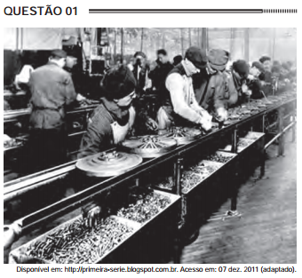

Na imagem do início do século XX, identifica-se um modelo produtivo cuja forma de organização fabril baseava-se na

- [ ] autonomia do produtor direto.
- [ ] adoção da divisão sexual do trabalho.
- [x] exploração do trabalho repetitivo.
- [ ] utilização de empregados qualificados
- [ ] incentivo à criatividade dos funcionários.

Na imagem verificamos os trabalhadores enfileirados em meio ao exercício do trabalho repetitivo. Essa estrutura caracteriza-se também pela separação de tarefas e por uma rigorosa disciplina. Esse modelo produtivo, embora acelerasse a produção, também tornava o trabalho alienante.
