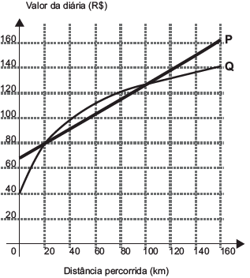

Atualmente existem diversas locadoras de veículos permitindo uma concorrência saudável para o mercado fazendo com que os preços se tornem acessíveis. Nas locadoras P e Q, o valor da diária de seus carros depende da distância percorrida, conforme o gráfico.

 

Disponível em: www.sempretops.com. Acesso em: 7 ago. 2010

 

O valor pago na locadora Q é menor ou igual àquele pago na locadora P para distâncias, em quilômetros, presentes em qual(is) intervalo(s)?

- [ ] De 20 a 100.
- [ ] De 80 a 130
- [ ] De 100 a 160.
- [x] De 0 a 20 e de 100 a 160.
- [ ] De 40 a 80 e de 130 a 160.

O valor pago na locadora Q é menor que o pago na locadora P quando o gráfico de Q ficar abaixo de P e igual na intersecção.

Assim, temos de 0 a 20 e de 100 a 160.
