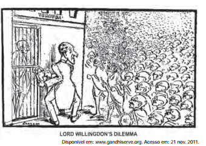

# q

O cartum, publicado em 1932, ironiza as consequências sociais das constantes prisões de Mahatma Gandhi pelas autoridades britânicas, na Índia, demonstrando

# a
a ineficiência do sistema judiciário inglês no território indiano.

# b
o apoio da população hindu à prisão de Gandhi.

# c
o caráter violento das manifestações hindus frente à ação inglesa.

# d
a impossibilidade de deter o movimento liderado por Gandhi.

# e
a indiferença das autoridades britânicas frente ao apelo popular hindu.

# r
d

# s
No processo de independência da Índia, Gandhi teve grande influência por defender a desobediência civil, de forma não violenta, contra os interesses ingleses. Na charge os manifestantes são representados pela figura de Gandhi e o carcereiro se apresenta receoso.
