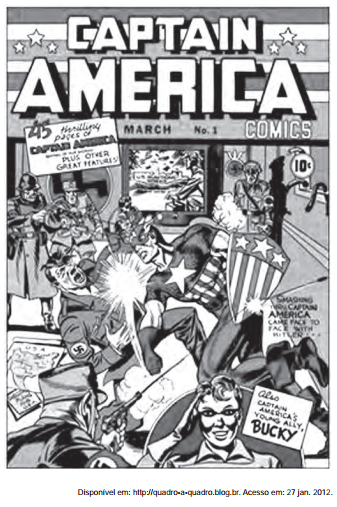

Com sua entrada no universo dos gibis, o Capitão chegaria para apaziguar a agonia, o autoritarismo militar e combater a tirania. Claro que, em tempos de guerra, um gibi de um herói com uma bandeira americana no peito aplicando um sopapo no Fürer só poderia ganhar destaque, e o sucesso não demoraria muito a chegar.

COSTA, C. Capitão América, o primeiro vingador: crítica. Disponível em: www.revistastart.com.br. Acesso em: 27 jan. 2012 (adaptado).

A capa da primeira edição norte-americana da revista do Capitão América demonstra sua associação com a participação dos Estados Unidos na luta contra

- [ ] a Tríplice Aliança, na Primeira Guerra Mundial.
- [x] os regimes totalitários, na Segunda Guerra Mundial.
- [ ] o poder soviético, durante a Guerra Fria.
- [ ] o movimento comunista, na Guerra do Vietnã
- [ ] o terrorismo internacional, após 11 de setembro de 2001

A capa da primeira edição norte-americana da revista do Capitão América evidencia a participação dos EUA na luta contra regimes totalitários que compunham o Eixo (no caso da imagem publicada, a Alemanha nazista) durante o confl ito da Segunda Guerra Mundial. Vale destacar certa imprecisão da banca, visto o caráter totalitário do regime soviético, aliado aos norte-americanos.

        