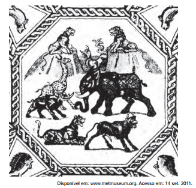

# q

A figura apresentada é de um mosaico, produzido por volta do ano 300 d.C., encontrado na cidade de Lod, atual Estado de Israel. Nela, encontram-se elementos que representam uma característica política dos romanos no período, indicada em:

# a
Cruzadismo – conquista da terra santa.

# b
Patriotismo – exaltação da cultura local.

# c
Helenismo – apropriação da estética grega.

# d
Imperialismo – selvageria dos povos dominados.

# e
Expansionismo – diversidade dos territórios conquistados.

# r
e

# s
A imagem nos permite perceber fi guras de animais de diversas partes do mundo. Dessa forma, podemos concluir a referência a outros territórios conquistados ao longo da trajetória histórica romana, que em um dado momento foi fundada em uma política expansionista.
