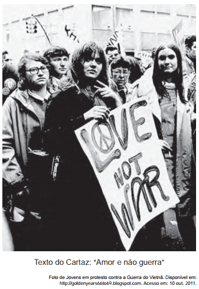

# q

Nos anos que se seguiram à Segunda Guerra, movimentos como o Maio de 1968 ou a campanha contra a Guerra do Vietnã culminaram no estabelecimento de diferentes formas de participação política. Seus slogans, tais como “Quando penso em revolução quero fazer amor”, se tornaram símbolos da agitação cultural nos anos 1960, cuja inovação relacionava-se

# a
à contestação da crise econômica europeia, que fora provocada pela manutenção das guerras coloniais.

# b
à organização partidária da juventude comunista, visando o estabelecimento da ditadura do proletariado

# c
à unificação das noções de libertação social e libertação individual, fornecendo um significado político ao uso do corpo

# d
à defesa do amor cristão e monogâmico, com fins à reprodução, que era tomado como solução para os conflitos sociais.

# e
ao reconhecimento da cultura das gerações passadas, que conviveram com a emergência do rock e outras mudanças nos costumes.

# r
c

# s
As manifestações na década de 1960 foram marcadas por questões políticas, como a contestação à Guerra do Vietnã, e por questões comportamentais associadas a mudanças nos âmbitos da sexualidade, das vestimentas e das relações sociais.
