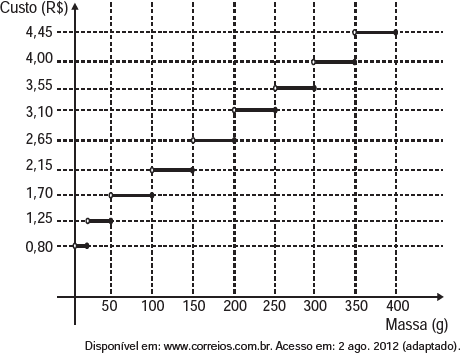

# q
     Deseja-se postar cartas não comerciais, sendo duas de 100 g, três de 200 g e uma de 350 g. O gráfico mostra o custo para enviar uma carta não comercial pelos Correios:

O valor total gasto, em reais, para postar essas cartas é de

# a
8,35.

# b
12,50.

# c
14,40.

# d
15,35.

# e
18,05.

# r
d

# s
A partir do gráfico, o valor total gasto, em reais, para postar essas cartas é dado por:

2 x 1,70 + 3 x 2,65 + 1 x 4 = 15,35.
