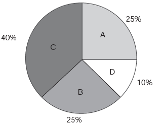

     Foi realizado um levantamento nos 200 hotéis de uma cidade, no qual foram anotados os valores, em reais, das diárias para um quarto padrão de casal e a quantidade de hotéis para cada valor da diária. Os valores das diárias foram: A = R$ 200,00; B = R$ 300,00; C = R$ 400,00 e D = R$ 600,00. No gráfico, as áreas representam as quantidades de hotéis pesquisados, em porcentagem, para cada valor da diária.

O valor mediano da diária, em reais, para o quarto padrão de casal nessa cidade, é

- [ ] 300,00.
- [ ] 345,00.
- [x] 350,00.
- [ ] 375,00.
- [ ] 400,00.

Colocando as diárias em um rol, tem-se:

•   do 1º até o 50º hotel: R$200,00

•   do 51º até o 100º hotel: R$300,00

• do 101º até o 180º hotel: R$400,00

• do 181º até o 200º hotel: R$600,00

O valor mediano (Md) das diárias é a média aritmética entre a 100ª e a 101ª diárias.

$Md = \cfrac{R$\\,300 + R$\\,400}{2} = R$\\,350,00$
