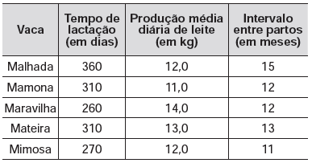

     O índice de eficiência utilizado por um produtor de leite para qualificar suas vacas é dado pelo produto do tempo de lactação (em dias) pela produção média diária de leite (em kg), dividido pelo intervalo entre partos (em meses). Para esse produtor, a vaca é qualificada como eficiente quando esse índice é, no mínimo, 281 quilogramas por mês, mantendo sempre as mesmas condições de manejo (alimentação, vacinação e outros). Na comparação de duas ou mais vacas, a mais eficiente é a que tem maior índice.

A tabela apresenta os dados coletados de cinco vacas:

Após a análise dos dados, o produtor avaliou que a vaca mais eficiente é a

 

- [ ] Malhada.
- [ ] Mamona.
- [ ] Maravilha.
- [x] Mateira.
- [ ] Mimosa.

O índice para cada vaca é:

• Malhada: $\cfrac{360 \cdot 12,0}{15} = 288$

• Mamona: $\cfrac{310\cdot 11,0}{12} \approx 284,2$

• Maravilha: $\cfrac{260\cdot 14,0}{12} \approx 303,3$

• Mateira: $\cfrac{310 \cdot 13,0}{13} = 310$

• Mimosa: $\cfrac{270\cdot 12,0}{11} \approx 294,5$

A vaca mais eficiente é a Mateira.
