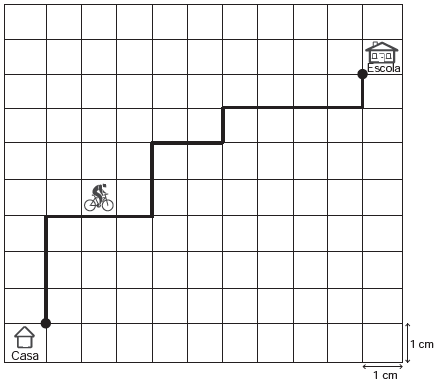

     A Secretaria de Saúde de um município avalia um programa que disponibiliza, para cada aluno de uma escola municipal, uma bicicleta, que deve ser usada no trajeto de ida e volta, entre sua casa e a escola. Na fase de implantação do programa, o aluno que morava mais distante da escola realizou sempre o mesmo trajeto, representado na figura, na escala 1 : 25 000, por um período de cinco dias.

Quantos quilômetros esse aluno percorreu na fase de implantação do programa?

- [ ] 4
- [ ] 8
- [ ] 16
- [ ] 20
- [x] 40

O trajeto de ida e volta do aluno, na escala da figura, tem 32cm de extensão. Sendo d a distância percorrida por ele em um dia, em quilômetros, tem-se:

$\cfrac{1}{25.000} = \cfrac{32}{d\cdot100.000}$

$d = 8$

Portanto, em cinco dias o aluno percorreu 5 x 8km, ou seja, 40km.

        