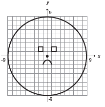
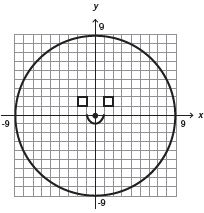
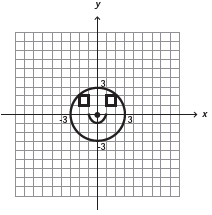
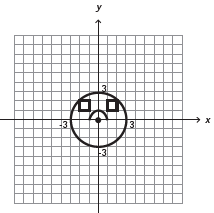
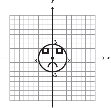

     Durante uma aula de Matemática, o professor sugere aos alunos que seja fixado um sistema de coordenadas cartesianas (x, y) e representa na lousa a descrição de cinco conjuntos algébricos, I, II, III, IV e V, como se segue:

     I — é a circunferência de equação $x^2 + y^2 = 9$;

     II — é a parábola de equação $y = -x^2-1$, com x variando de −1 a 1;

     III — é o quadrado formado pelos vértices (−2, 1), (−1, 1), (−1, 2) e (−2, 2);

     IV — é o quadrado formado pelos vértices (1, 1), (2, 1), (2, 2) e (1, 2);

     V — é o ponto (0, 0).

     A seguir, o professor representa corretamente os cinco conjuntos sobre uma mesma malha quadriculada, composta de quadrados com lados medindo uma unidade de comprimento, cada, obtendo uma figura.

- [ ] 
- [ ] 
- [ ] 
- [ ] 
- [x] 

I. $x^2 + y^2 = 3^2$ (circunferência de centro na origem e raio 3)

II. $y = -x^2-1$ (parábola com concavidade para baixo, cuja intersecção com o eixo y é –1)

III. (–2, 1), (–1, 1), (–1, 2) e (–2, 2)

IV. (1, 1), (2, 1), (2, 2) e (1, 2)

V. (0, 0)

A figura desenhada pelo professor foi a figura E.
