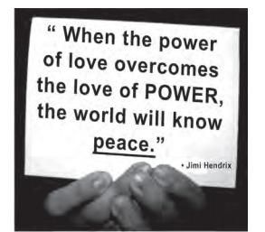

Aproveitando-se de seu status social e da possível influência sobre seus fãs, o famoso músico Jimi Hendrix associa, em seu texto, os termos love, power e peace para justificar sua opinião de que

- [ ] a paz tem o poder de aumentar o amor entre os homens.
- [x] o amor pelo poder deve ser menor do que o poder do amor.
- [ ] o poder deve ser compartilhado entre aqueles que se amam.
- [ ] o amor pelo poder é capaz de desunir cada vez mais as pessoas
- [ ] a paz será alcançada quando a busca pelo poder deixar de existir.

Jimi Hendrix associa os termos love, power e peace para justificar sua opinião de que o amor pelo poder deve ser menor do que o poder do amor. Tradução do texto: “Quando o poder do amor superar o amor pelo poder, o mundo conhecerá a paz.”

        