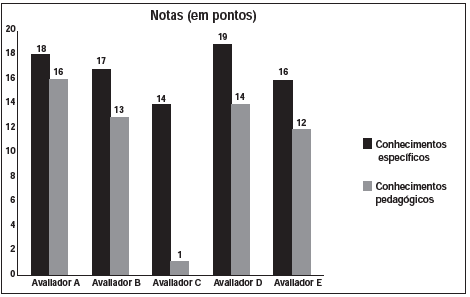

     As notas de um professor que participou de um processo seletivo, em que a banca avaliadora era composta por cinco membros, são apresentadas no gráfico. Sabe-se que cada membro da banca atribuiu duas notas ao professor, uma relativa aos conhecimentos específicos da área de atuação e outra, aos conhecimentos pedagógicos, e que a média final do professor foi dada pela média aritmética de todas as notas atribuídas pela banca avaliadora.

     Utilizando um novo critério, essa banca avaliadora resolveu descartar a maior e a menor notas atribuídas ao professor.

A nova média, em relação à média anterior, é

- [ ] 0,25 ponto maior.
- [x] 1,00 ponto maior.
- [ ] 1,00 ponto menor.
- [ ] 1,25 ponto maior.
- [ ] 2,00 pontos menor.

Média aritmética:

$\overline{X} = \cfrac{18+16+17+13+14+1+19+14+16+12}{10} = \cfrac{140}{10} = 14$

Utilizando o novo critério, descartam-se as notas 19 e 1, assim:

$\overline{X} = \cfrac{18+16+17+13+14+14+16+12}{8} = \cfrac{120}{8} = 15$

Como a média anterior era 14, a nova média é 1 ponto maior.
