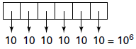
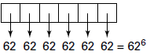

     Um banco solicitou aos seus clientes a criação de uma senha pessoal de seis dígitos, formada somente por algarismos de 0 a 9, para acesso à conta corrente pela internet.

     Entretanto, um especialista em sistemas de segurança eletrônica recomendou à direção do banco recadastrar seus usuários, solicitando, para cada um deles, a criação de uma nova senha com seis dígitos, permitindo agora o uso das 26 letras do alfabeto, além dos algarismos de 0 a 9. Nesse novo sistema, cada letra maiúscula era considerada distinta de sua versão minúscula. Além disso, era proibido o uso de outros tipos de caracteres.

     Uma forma de avaliar uma alteração no sistema de senhas é a verificação do coeficiente de melhora, que é a razão do novo número de possibilidades de senhas em relação ao antigo.

O coeficiente de melhora da alteração recomendada é

- [x] $\cfrac{62^6}{10^6}$
- [ ] $\cfrac{62!}{10!}$
- [ ] $\cfrac{62!\cdot4!}{10!\cdot56!}$
- [ ] $62! - 10!$
- [ ] $62^6 - 10^6$

Calculemos a senha pessoal inicial:

Calculemos a senha pessoal segundo o especialista:

(em que 62 é a soma das 52 letras, 26 maiúsculas e 26 minúsculas, com 10 algarismos).

O coeficiente é: $\cfrac{62^6}{10^6}$.

        