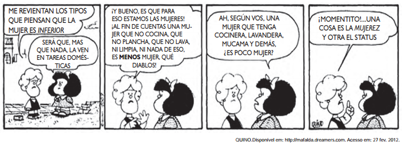

A personagem Susanita, no último quadro, inventa o vocábulo mujerez, utilizando-se de um recurso de formação de palavra existente na língua espanhola. Na concepção da personagem, o sentido do vocábulo mujerez remete à

- [ ] falta de feminilidade das mulheres que não se dedicam às tarefas domésticas.
- [x] valorização das mulheres que realizam todas as tarefas domésticas.
- [ ] inferioridade das mulheres que praticam as tarefas domésticas.
- [ ] relevância social das mulheres que possuem empregados para realizar as tarefas domésticas.
- [ ] independência das mulheres que não se prendem apenas às tarefas domésticas.

A personagem Susanita inventa o vocábulo “mujerez” para indicar a valorização das mulheres que realizam as tarefas domésticas.
