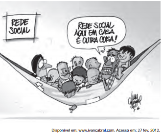

O efeito de sentido da charge é provocado pela combinação de informações visuais e recursos linguísticos. No contexto da ilustração, a frase proferida recorre à

- [x] polissemia, ou seja, aos múltiplos sentidos da expressão “rede social” para transmitir a ideia que pretende veicular.
- [ ] ironia para conferir um novo significado ao termo “outra coisa”.
- [ ] homonímia para opor, a partir do advérbio de lugar, o espaço da população pobre e o espaço da população rica.
- [ ] personificação para opor o mundo real pobre ao mundo virtual rico.
- [ ] antonímia para comparar a rede mundial de computadores com a rede caseira de descanso da família.

A frase é polissêmica porque estão implicados os sentidos de rede como “sistema interligado de computadores” e como “artefato que serve para dormir”.
