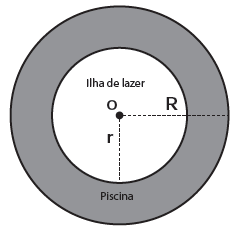

     Num parque aquático existe uma piscina infantil na forma de um cilindro circular reto, de 1 m de profundidade e volume igual a 12 $m^3$, cuja base tem raio R e centro O. Deseja-se construir uma ilha de lazer seca no interior dessa piscina, também na forma de um cilindro circular reto, cuja base estará no fundo da piscina e com centro da base coincidindo com o centro do fundo da piscina, conforme a figura. O raio da ilha de lazer será r. Deseja-se que após a construção dessa ilha, o espaço destinado à água na piscina tenha um volume de, no mínimo, 4 $m^3$.

Considere 3 como valor aproximado para p.

Para satisfazer as condições dadas, o raio máximo da ilha de lazer **r**, em metros, estará mais próximo de

- [x] 1,6.
- [ ] 1,7.
- [ ] 2,0.
- [ ] 3,0.
- [ ] 3,8.

O raio r será máximo quando o volume do cilindro circular reto de raio da base R e altura 1 m (que representa a ilha de lazer) for igual a 12 – 4 = 8 $m^3$. Assim :

$\pi \cdot r^2 \cdot 1 = 8$

$r = \sqrt{\cfrac{8}{\pi}}$

Como $\pi = 3$, tem-se $r = \sqrt{\cfrac{8}{\pi}} = \cfrac{2 \cdot \sqrt{2}}{\sqrt{3}} = \cfrac{2 \cdot \sqrt{2}\cdot \sqrt{3}}{3}$

Como $\sqrt{2} = 1,41$ e $\sqrt{3} = 1,73$, tem-se:

$r \approx 1,62$
