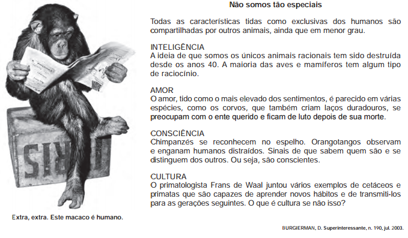

O título do texto traz o ponto de vista do autor sobre a suposta supremacia dos humanos em relação aos outros animais. As estratégias argumentativas utilizadas para sustentar esse ponto de vista são

 

- [ ] definição e hierarquia.
- [x] exemplificação e comparação
- [ ] causa e consequência.
- [ ] finalidade e meios.
- [ ] autoridade e modelo.

A estratégia argumentativa é apontar em animais exemplos de comportamentos tidos como exclusivos e definidores dos seres humanos.
