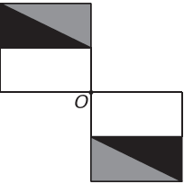

Um programa de edição de imagens possibilita transformar figuras em outras mais complexas. Deseja-se construir uma nova figura a partir da original. A nova figura deve apresentar simetria em relação ao ponto O.

\
**Figura original**

 

A imagem que representa a nova figura é:

- [ ] 
- [ ] 
- [ ] 
- [ ] 
- [x] 

Nomeando os vértices da figura, tem-se:

Analisando as alternativas, a única que apresenta todos os pontos das 2 figuras em simetria ao ponto O é:

Em que

$\overline{AO} = \overline{OA'} $

$\overline{BO} = \overline{OB'}$

$\overline{DO} = \overline{OD'}$

$\overline{CO} = \overline{OC'}$
